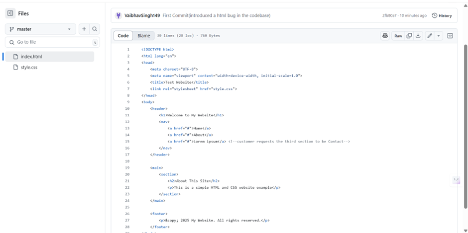
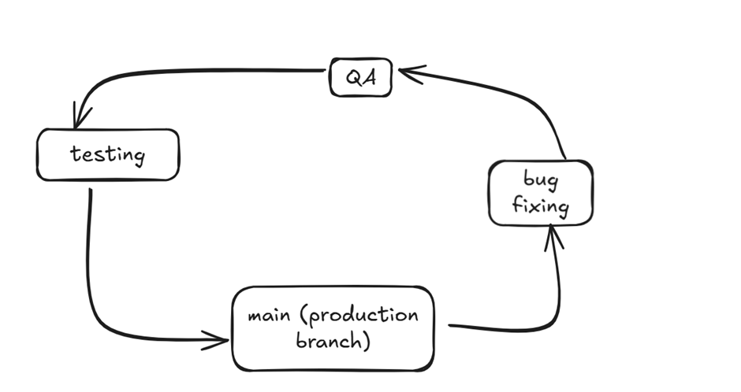
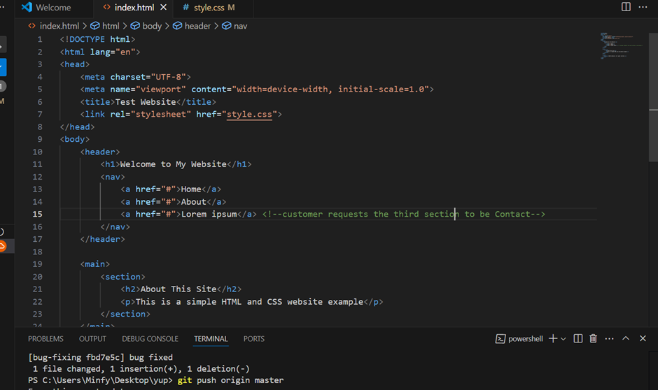
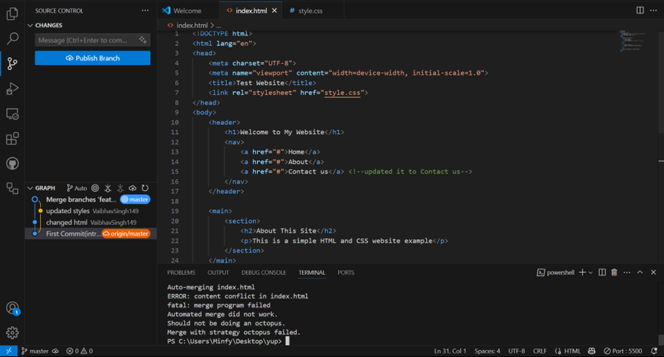
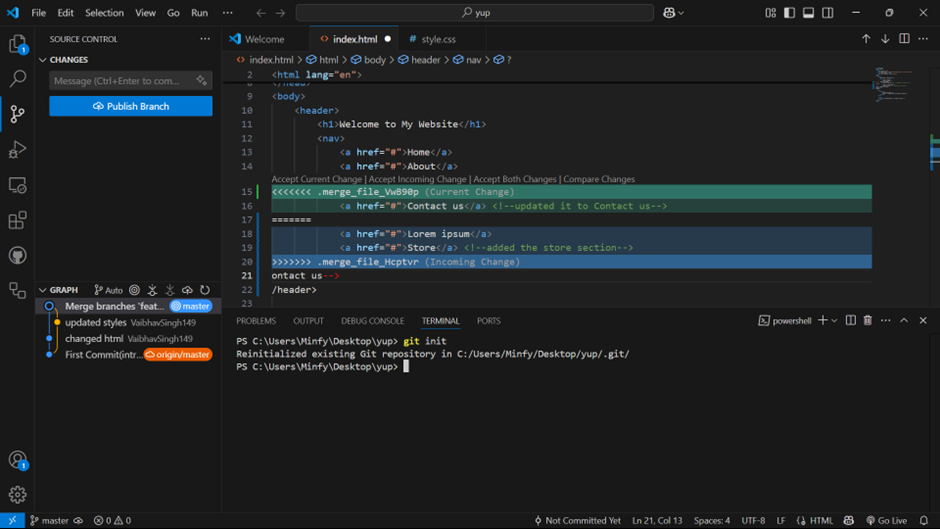
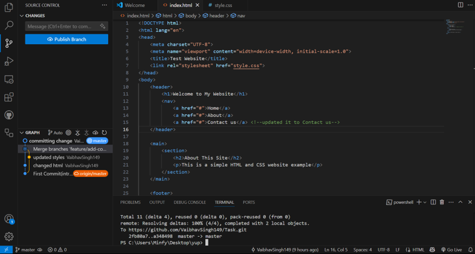
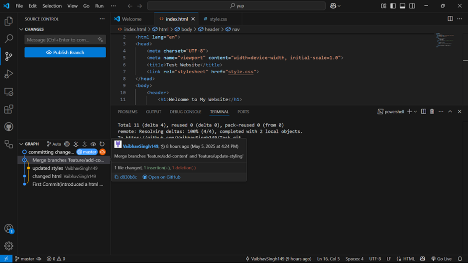

Created a repo and created a basic html css website with bugs in it 
(will show resolving bugs then move towards conflicting errors)
Issue - The third section has lorem ipsum instead of “Contact us”

The architecture for workflow generally is

 
Changes that we’ll be making

In the style css file 

 

Made changes to the html file and merged them using Octopus Merge which failed due to conflicting issues as same file was edited both times

Changes conflicting

Resolving the changes 

 

The conflict I created was caused due to making edits to the same file, which caused a version error while pushing the file as at the same time there were two versions of the same files, the possibility to resolve this was to accept one change or both, as per the question it was required to accept both and that is exactly how I resolved the error
